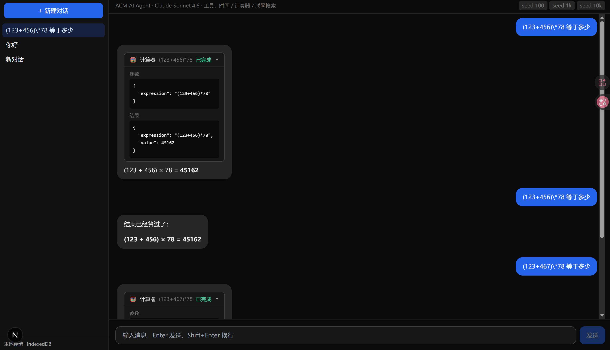

# ACM AI Agent

<p align="center">
  基于 Next.js 15 + Vercel AI SDK + Claude 的通用对话 AI agent<br/>
  支持多步工具调用、流式响应、虚拟滚动、IndexedDB 多会话持久化
</p>

<p align="center">
  <a href="https://acm-ai-pearl.vercel.app/"></a>
  <a href="https://github.com/crispy-A/ACM-ai-/actions"></a>
  
  
  
</p>

<p align="center">
  <b><a href="https://acm-ai-pearl.vercel.app/">→ 在线体验</a></b>
  &nbsp;·&nbsp;
  <b><a href="docs/blog/tool-calling.md">→ 技术博客：多步工具调用 + 可视化</a></b>
</p>

<p align="center">
  
</p>

> 如果上面截图还没显示，是因为我还没把 `docs/screenshots/hero.png` 放进仓库。录完 GIF 或截图直接替换即可。

## 特性

- **流式对话** — SSE 流式渲染 Claude 响应
- **多会话管理** — IndexedDB 持久化（Dexie）+ 路由 `/chat/[id]`，侧边栏新建/删除/双击重命名
- **Markdown + 代码高亮** — react-markdown + highlight.js，代码块一键复制
- **多步工具调用 (Tool Use)** — agentic 循环（`maxSteps: 5`），内置三个工具：
  - `get_current_time` — 时区感知的时间查询
  - `calculator` — 正则白名单的安全表达式求值
  - `web_search` — Tavily 联网搜索
- **工具调用可视化** — 可折叠卡片展示入参 / 状态 / 结果
- **虚拟滚动** — react-virtuoso，万条消息对话保持流畅
- **按需加载** — markdown 渲染器首屏不加载，拆出 71 kB（−28.5%）
- **完整工程链路** — Vitest 单测（23 个）+ Playwright E2E（3 个）+ GitHub Actions CI

## 架构

```
┌────────────────────────────────────────────────────────────────┐
│                         浏览器 (Next.js Client)                 │
│                                                                 │
│  ┌──────────────┐     ┌──────────────┐    ┌──────────────┐     │
│  │  ChatView    │────▶│   useChat    │───▶│  Virtuoso    │     │
│  │  (Virtuoso)  │     │ (AI SDK hook)│    │  (虚拟滚动)  │     │
│  └──────────────┘     └──────┬───────┘    └──────────────┘     │
│         │                    │                                  │
│         ▼                    │ POST /api/chat                   │
│  ┌──────────────┐             ▼                                 │
│  │    Dexie     │    ┌──────────────────┐                       │
│  │ (IndexedDB)  │    │  Next.js Route   │                       │
│  │ 会话/消息持久化│   │  streamText +    │                       │
│  └──────────────┘    │  tools + maxSteps│                       │
│                      └────────┬─────────┘                       │
└───────────────────────────────┼─────────────────────────────────┘
                                │
                      ┌─────────┴──────────┐
                      ▼                    ▼
              ┌───────────────┐    ┌───────────────┐
              │ Claude Sonnet │    │  Tool APIs    │
              │  (Anthropic)  │    │  (Tavily etc.)│
              └───────────────┘    └───────────────┘
```

## 快速开始

```bash
cp .env.local.example .env.local   # 填入 ANTHROPIC_API_KEY 和可选的 TAVILY_API_KEY
npm install
npm run dev                        # http://localhost:3000
```

## 技术栈

- Next.js 15 (App Router) + React 19 + TypeScript strict
- Vercel AI SDK (`ai` + `@ai-sdk/anthropic` + `@ai-sdk/react`)
- Dexie (IndexedDB) · react-virtuoso · react-markdown · highlight.js
- Tailwind CSS
- 默认模型：Claude Sonnet 4.6

## 性能

在 `NODE_ENV=development` 下，消息区右上角有 **seed 100 / 1k / 10k** 按钮，可一键向当前会话灌入指定数量的假消息用于性能测试。

### First Load JS

| 路由         | 改造前 | 改造后 | 降幅   |
| ------------ | ------ | ------ | ------ |
| `/`          | 249 kB | 178 kB | −28.5% |
| `/chat/[id]` | 249 kB | 178 kB | −28.5% |

改造手段：

- markdown 渲染器（`react-markdown` + `remark-gfm` + `rehype-highlight` + `highlight.js`）用 `next/dynamic` 按需加载
- bundle 分析：`npm run analyze`

### 流式渲染

- 流式期间消息气泡走 `<PlainText>` 简单路径，完成后才切换到 markdown 重渲，避免每个 token 都重跑 rehype-highlight
- `MessageBubble` 用 `React.memo` 按 `id + content + parts` 做自定义比较，未变更的历史消息零 re-render
- 虚拟滚动只渲染视口内 ~10 条消息，不管历史多长渲染成本都恒定

### 量化方法（面试可讲）

1. 开 DevTools → Performance，点 Record
2. 侧边栏新建会话 → 点 `seed 10k` → 灌入一万条消息
3. 拖动滚动条上下滚动 5 秒，Stop → 看 FPS、Main thread busy time
4. 切换 CPU throttling 4×，重复测
5. Lighthouse → Performance / LCP / TBT
6. `npm run analyze` 打开 bundle 树图确认拆分点

## 目录结构

```
app/
├── api/chat/route.ts         # streamText + tools + maxSteps
├── chat/[id]/page.tsx        # 动态会话路由
├── page.tsx                  # 新建会话引导
├── layout.tsx
└── globals.css

components/
├── chat-view.tsx             # 对话主视图（Virtuoso）
├── message-bubble.tsx        # 气泡（memo + 按需加载 markdown）
├── markdown.tsx              # react-markdown + 代码块复制
├── sidebar.tsx               # 会话列表
└── tool-invocation-card.tsx  # 工具调用可视化

lib/
├── ai/tools.ts               # 三个工具定义
├── db.ts                     # Dexie schema + CRUD
├── seed.ts                   # 假数据生成（性能测试）
└── types.ts

test/                         # Vitest 单元测试
e2e/                          # Playwright 端到端
.github/workflows/ci.yml      # CI: typecheck + test + build + e2e
```

## 测试

```bash
npm test              # Vitest 单测（23 个，~1s）
npm run test:watch    # 监视模式
npm run test:e2e      # Playwright 端到端（3 个）
npm run typecheck     # 三份 tsconfig：主包 + test + e2e
```

单测覆盖：

- `lib/ai/tools.ts` — calculator 正则白名单防注入、时区处理、Tavily fetch mock
- `lib/db.ts` — IndexedDB CRUD（fake-indexeddb）、会话隔离、parts 持久化
- `components/tool-invocation-card.tsx` — 折叠展开、web_search 特殊渲染

E2E 覆盖（`MOCK_LLM=1` 避免消耗 API 额度）：

- 首次进入发消息 → 自动建会话 → 看到流式回复
- 侧边栏显示新建的会话
- 新建对话按钮跳到新的空会话

CI 在每次 push / PR 时自动跑完上面全部内容。

## 代码质量

```bash
npm run format        # Prettier 全量格式化
npm run format:check  # CI 用的只检查不改
npm run lint          # ESLint (flat config)
npm run lint:fix      # 自动修复
```

提交守门（Husky）：

- **pre-commit** → `lint-staged`：只对已暂存文件跑 `eslint --fix` + `prettier --write`，不影响未改的代码
- **commit-msg** → `commitlint`：强制 [Conventional Commits](https://www.conventionalcommits.org/)（`feat:` / `fix:` / `chore:` ...），`git push xxx` 这种无类型前缀的 commit 会被拒

本地一次 `git commit` 会自动：

```
1. 对 staged 的 .ts/.tsx 跑 ESLint + Prettier → 失败阻止提交
2. 校验 commit message 是否符合 Conventional Commits → 失败阻止提交
```

CI 里也兜底跑一遍 `format:check` + `lint`，防止绕过钩子的提交合入 main。

## 下一步

- [x] 测试：Vitest 单测 + Playwright 端到端
- [x] GitHub Actions CI（typecheck + lint + test + build）
- [x] 部署到 Vercel
- [x] 代码质量基础设施（Prettier + ESLint flat + Husky + lint-staged + Commitlint）
- [ ] 流式期间实时持久化（修断电丢回复）
- [ ] 多模态上传（图片 / PDF + Claude Vision）
- [ ] 纯前端 RAG（embedding + IndexedDB 向量检索）
- [ ] 命令面板 `Cmd+K` + 键盘快捷键
- [ ] 无障碍：`aria-live` 流式朗读 / 焦点管理
